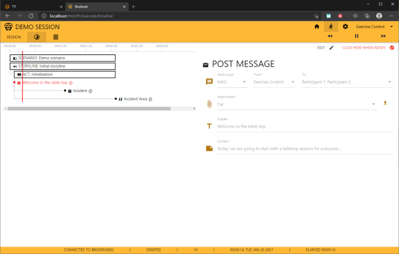

# Trial Management Tool (TMT)

A scenario editor and execution manager for testing crisis management systems.

In a Trial, experiment or exercise, there is a need to control the crisis management events that are exposed to the participants. The TMT helps you by:

- Organizing a Trial
  - Users, stakeholders and role players
  - Managing objectives and scenarios
  - Locations and objects that play a part in the scenario
- In a scenario, the events are grouped into:
  - Storylines, e.g. the main storyline
  - Injects, single messages for a simulator, participant or task for a role player
- Run a Scenario
  - The events are sent to remote simulators and solutions, e.g. to start a flooding or other incident.
  - Tasks are offered to role players, which need to execute them and indicate when they are done.

## Creating your own injects

This version of the scenario manager supports the creation of your own injects. This guide explains how:

1. Click on an existing scenario, or create a new one
2. Click on the gear icon in the top right corner
3. Click on the `Message Config` tab
4. Click on the green `+` icon
5. Fill in the form
    - `name` - The name of the new inject
    - `Material Icon Name` - The name of the icon used for this inject [Material Icons](https://materializecss.com/icons.html)
    - `Upload GUI` - Selecting this checkbox allows you to upload your own message form [Message Form](https://github.com/erikvullings/mithril-ui-form)
    - `Form for the message` - You can also select an existing message form
    - `Kafka topic for the message` - The kafka topic that the inject will be send to
    - `GeoJSON?` - If the new inject sends GeoJSON files, the scenario manager needs a namespace to ensure the data can be send on Kafka and be shown on a map.
6. Click the green save icon
7. Click on the pencil symbol in the top right corner
8. Test out your new inject!

If a kafka topic is missing, you should add this to the docker compose that you used to run this scenario-manager, and it will automatically show up in the GUI.

## Executing a scenario



## Installing

The application is a mono repository split into 3 packages:

- Server: responsible for storing the Trial data
- GUI: user interface for the creators of a scenario, managers of a scenario run (a.k.a. session) and role players
- Models: shared interfaces between GUI and server

To run it locally, it assumes you have [nodejs](http://nodejs.org/en/download) installed. Next, install the package manager using `npm i -g pnpm`. Use git to clone this repository with `git clone https://github.com/DRIVER-EU/scenario-manager.git`. Enter the new folder (`cd scenario-manager`) and install all dependencies with:

```bash
pnpm m i # alternatively, use `npm` instead of `pnpm`
```

To run the application, enter:

```console
npm start
```

This will run a [server at 3210](http://localhost:3210)
and a [GUI at 3388/tmt](http://localhost:3388/tmt).

## State management

During execution, all messages (a.k.a. injects) are pass through 5 states:

- Initially, they are ON_HOLD, except the main scenario (root), which is IN_PROGRESS
- When a message's parent is IN_PROGRESS, and it satisfies all timing conditions, it can transition to SCHEDULED.
- A SCHEDULED message, if it does not require manual confirmation, will automatically transition to IN_PROGRESS.
- A message that requires manual confirmation will wait for that: it will transition to IN_PROGRESS after receiving the confirmation (via the REST interface).
- An inject message IN_PROGRESS will be executed, which will make it transition to EXECUTED.
- A group (act, storyline) message will transition to EXECUTED when all of its children are EXECUTED too.
- There is a fifth state, CANCELLED, but that hasn't been implemented yet.

## TODO

- Check why role player's participant multi-select closes on each click
- When setting the send link's link type, it is not automatically saved
- When creating a new scenario, the title is not updated in the dropdown
- Add user selection
- Add user authorization
- Create default user/stakeholder/role-player etc when creating a new trial

- Add Tactical Simulation Object (EMSI) message.
- Add settings/items (e.g. buildings, vehicles, weapons, etc.)
  - Properties: Alias, title, description, picture.
  - Buildings may have occupants
  - Vehicles may have occupants
  - Items may have a location. This location can change in time.
- Add settings/actors (non-playing characters, NPG, or personas), which may carry items (but not buildings and vehicles).
  - May have a picture, age, home/work location, length, nickname, and other properties (bag).
  - May own/carry items.
- Add script message: An info message, not necessarily sent to the Test-bed, to tell the story.
  - May have a location | building, vehicles, items | actors
  - Buildings can contain vehicles, vehicles can transport actors, actors can carry items.
  - Use markdown to edit the text
  - Uses special mark-up to denote items, actors, etc. in the text, e.g. ITEM.weapon1 or ACTOR.bad_guy. In the generated HTML, they will be replaced by their title.
- Add map component to simulation view: show the state of all actors on the map when selecting an item:
  - When a message is selected, compute the current state of all actors/vehicles on the map.
  - This map may be shared using the test-bed (for the white cell).
- Manual actions are always simulated and carried out after 30 seconds. Make this customizable.
- Scenario selection and, optional, filtering, should be hidden when requested (kind of side menu).
- The session may run in a shorter time frame than the scenario. How to deal with the messages outside the current time frame? For example, the VENARI script is a couple of days long, whereas the action only takes place during certain hours.
